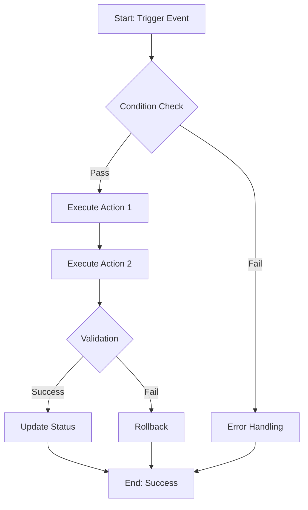

# Workflow Design Template

## Workflow Overview

**Workflow Name**: [Descriptive Name]
**Version**: 1.0
**Created**: YYYY-MM-DD
**Last Updated**: YYYY-MM-DD
**Author**: [Author Name]
**Status**: Draft | In Review | Active | Deprecated

---

## 📋 Workflow Summary

### Purpose
[Brief 1-2 sentence description of what this workflow accomplishes]

### Scope
- **Applies To**: Windows development environment, MCP integration, etc.
- **Frequency**: On-demand | Daily | Per-commit | Per-deployment
- **Automation Level**: Manual | Semi-automated | Fully automated

### Key Benefits
1. Benefit 1 (e.g., reduced manual effort)
2. Benefit 2 (e.g., improved consistency)
3. Benefit 3 (e.g., faster feedback loop)

---

## 🎯 Objectives & Success Metrics

### Primary Objectives
1. [Objective 1]
2. [Objective 2]
3. [Objective 3]

### Success Metrics
| Metric | Target | Measurement Method |
|--------|--------|-------------------|
| Time to complete | < 5 minutes | Script execution time |
| Error rate | < 1% | Failed executions / total runs |
| API success rate | > 99% | Successful API calls / total calls |

---

## 🔄 Workflow Diagram



**ASCII Alternative**:
```
[Trigger] → [Validation] → [Action 1] → [Action 2] → [Status Update] → [Complete]
                ↓                                           ↓
            [Error]  ←─────────────────────────────    [Rollback]
```

---

## 📝 Detailed Steps

### Step 1: Initialization
**Duration**: ~30 seconds
**Responsibility**: System / Script
**Trigger**: [Event that starts this step]

**Actions**:
1. Load environment variables
   ```powershell
   $linearKey = Get-Content "$env:USERPROFILE\.linear-api-key" -Raw
   ```
2. Validate prerequisites
3. Initialize logging

**Outputs**:
- Environment validated
- API keys loaded
- Log file created

**Error Handling**:
- If API key missing → Exit with error code 1
- If environment invalid → Display setup instructions

---

### Step 2: Data Collection
**Duration**: ~1 minute
**Responsibility**: Script / User
**Dependencies**: Step 1 completion

**Actions**:
1. Query Linear API for issue details
   ```powershell
   .\scripts\get-linear-issue.ps1 -IssueId "BOC-XXX"
   ```
2. Fetch related data from GitHub
3. Validate data integrity

**Inputs**:
- Issue ID (BOC-XXX)
- API credentials

**Outputs**:
- Issue metadata (JSON)
- Related commits
- Validation status

**Error Handling**:
- If API fails → Retry 3 times with exponential backoff
- If data invalid → Log error and notify user

---

### Step 3: Processing
**Duration**: ~2 minutes
**Responsibility**: MCP Server / Script
**Dependencies**: Step 2 completion

**Actions**:
1. Process data with Sequential Thinking MCP
   ```javascript
   // Use MCP sequential thinking tool
   await sequentialthinking({
       thought: "Analyze issue dependencies",
       thoughtNumber: 1,
       totalThoughts: 5
   });
   ```
2. Apply business logic
3. Generate output artifacts

**Processing Logic**:
```powershell
# Example: Status update logic
if ($issueCompleted) {
    .\scripts\sync-linear-status.ps1 -IssueId $id -Status "Done"
} else {
    .\scripts\sync-linear-status.ps1 -IssueId $id -Status "InReview"
}
```

**Outputs**:
- Processed results
- Generated artifacts
- Status updates

---

### Step 4: Validation & Testing
**Duration**: ~1 minute
**Responsibility**: Automated tests
**Dependencies**: Step 3 completion

**Actions**:
1. Run API key scanner
   ```powershell
   .\scripts\api-key-scanner.ps1 -Path . -Recursive
   ```
2. Validate MCP server connections
   ```bash
   node templates\mcp-integration-test.js
   ```
3. Execute pre-commit hooks

**Validation Criteria**:
- [ ] No API keys leaked
- [ ] All tests pass
- [ ] MCP servers responding
- [ ] Output files valid

---

### Step 5: Deployment / Finalization
**Duration**: ~30 seconds
**Responsibility**: Git / Linear API
**Dependencies**: Step 4 validation pass

**Actions**:
1. Commit changes to Git
   ```powershell
   git add .
   git commit -m "feat: Workflow implementation (BOC-XXX)"
   ```
2. Update Linear issue status
   ```powershell
   .\scripts\add-linear-comment.ps1 -IssueId "BOC-XXX" `
       -Body "✅ Workflow completed successfully" `
       -UpdateStatus -NewStatus "Done"
   ```
3. Push to GitHub
   ```powershell
   git push origin main
   ```

**Completion Criteria**:
- Changes committed
- Linear issue updated
- GitHub synchronized

---

## 🔌 MCP Server Integration

### Sequential Thinking MCP
**Usage**: Multi-step problem solving during processing phase

**Integration Point**: Step 3 (Processing)

**Example**:
```javascript
const { sequentialthinking } = require('mcp-server-sequential-thinking');

await sequentialthinking({
    thought: "Step 1: Analyze current workflow state",
    nextThoughtNeeded: true,
    thoughtNumber: 1,
    totalThoughts: 5
});
```

---

### n8n Workflow Automation
**Usage**: Trigger external workflows on completion

**Integration Point**: Step 5 (Finalization)

**Example**:
```powershell
# Trigger n8n webhook
$webhookUrl = "http://localhost:5678/webhook/workflow-complete"
Invoke-RestMethod -Uri $webhookUrl -Method POST -Body @{
    issueId = "BOC-XXX"
    status = "Done"
} | ConvertTo-Json
```

---

### Linear API
**Usage**: Issue tracking and status updates throughout workflow

**Integration Points**: Steps 2, 3, 5

**GraphQL Queries**:
```graphql
# Get issue details
query {
    issue(id: "ISSUE_ID") {
        id
        title
        state { name }
        assignee { name }
    }
}

# Update status
mutation {
    issueUpdate(
        id: "ISSUE_ID",
        input: { stateId: "STATE_ID" }
    ) {
        success
    }
}
```

---

## 🔒 Security Considerations

### API Key Management
- **Storage**: All API keys in `$env:USERPROFILE\.{service}-api-key`
- **Access**: Read-only, 0600 permissions (if applicable)
- **Validation**: Pre-commit hook scans for leaks

### Pre-commit Checks
```bash
# Automatic scan before every commit
🔒 Scanning for API keys...
⏭️  Skipping safe file: scripts/setup-windows-environment.ps1
✅ No API keys detected in staged files
```

### Error Logging
- **Sensitive Data**: Never log API keys or tokens
- **Sanitization**: Mask credentials in error messages
- **Location**: Logs stored in `logs/` directory (git-ignored)

---

## 🐛 Error Handling & Recovery

### Common Errors

#### Error 1: API Key Not Found
**Symptom**: Script exits with "API key not found"

**Solution**:
```powershell
# Run setup script
.\scripts\setup-windows-environment.ps1

# Or manually create key file
Set-Content "$env:USERPROFILE\.linear-api-key" -Value "YOUR_KEY_HERE"
```

---

#### Error 2: Linear API Rate Limit
**Symptom**: HTTP 429 Too Many Requests

**Solution**:
- Implement exponential backoff
- Reduce request frequency
- Cache responses when possible

**Code**:
```powershell
$retryCount = 0
$maxRetries = 3

while ($retryCount -lt $maxRetries) {
    try {
        $response = Invoke-RestMethod -Uri $apiUrl -Headers $headers
        break
    } catch {
        if ($_.Exception.Response.StatusCode -eq 429) {
            $retryCount++
            Start-Sleep -Seconds ([Math]::Pow(2, $retryCount))
        } else {
            throw
        }
    }
}
```

---

#### Error 3: MCP Server Unavailable
**Symptom**: Connection refused or timeout

**Solution**:
1. Validate MCP server installation
   ```powershell
   .\scripts\validate-mcp-servers.ps1
   ```
2. Check Claude Desktop config
   ```powershell
   cat "$env:APPDATA\Claude\claude_desktop_config.json"
   ```
3. Restart Claude Desktop

---

### Rollback Procedures

**When to Rollback**:
- Validation fails in Step 4
- API errors exceed retry limit
- Data integrity compromised

**Rollback Steps**:
1. Revert Git changes: `git reset --hard HEAD~1`
2. Restore Linear issue status to previous state
3. Log rollback event
4. Notify user of failure

---

## 📊 Monitoring & Logging

### Log Levels
- **INFO**: Normal workflow progress
- **WARN**: Non-critical issues (retries, slow responses)
- **ERROR**: Critical failures requiring attention

### Log Format
```
[2025-10-02 12:34:56] [INFO] Workflow started: BOC-123
[2025-10-02 12:35:01] [INFO] Step 1 completed: Environment validated
[2025-10-02 12:35:15] [WARN] Linear API slow response: 2.5s
[2025-10-02 12:35:45] [INFO] Step 5 completed: Status updated to Done
```

### Metrics Collection
```powershell
# Track workflow execution time
$startTime = Get-Date
# ... workflow steps ...
$duration = (Get-Date) - $startTime

# Log metrics
Add-Content "logs/metrics.log" -Value "$(Get-Date),$workflowName,$duration"
```

---

## 🧪 Testing Strategy

### Unit Tests
- Test individual scripts in isolation
- Mock API responses
- Validate error handling

### Integration Tests
```bash
# Test full workflow end-to-end
node templates\mcp-integration-test.js --all
```

### Manual Testing Checklist
- [ ] Run workflow with valid inputs
- [ ] Test with missing API key
- [ ] Simulate API failure
- [ ] Verify rollback mechanism
- [ ] Check log files for completeness

---

## 📚 Dependencies

### Required Tools
- PowerShell 7.x or higher
- Node.js 18.x or higher
- Git 2.x or higher
- Claude Desktop (for MCP integration)

### Required Scripts
- `scripts/sync-linear-status.ps1`
- `scripts/add-linear-comment.ps1`
- `scripts/api-key-scanner.ps1`
- `templates/mcp-integration-test.js`

### External APIs
- Linear API (GraphQL)
- GitHub API (REST)
- n8n Webhook API (if applicable)

---

## 🔄 Maintenance & Updates

### Review Schedule
- **Weekly**: Check for failed executions
- **Monthly**: Review metrics and optimize
- **Quarterly**: Update dependencies

### Version History
| Version | Date | Changes | Author |
|---------|------|---------|--------|
| 1.0 | 2025-10-02 | Initial workflow design | [Author] |

### Deprecation Plan
- If workflow becomes obsolete, archive to `workflows/deprecated/`
- Update references in documentation
- Notify team of replacement workflow

---

## 💡 Best Practices

1. **Always validate inputs** before processing
2. **Log all API interactions** for debugging
3. **Use pre-commit hooks** to prevent API key leaks
4. **Implement retries** for transient failures
5. **Keep workflows modular** for reusability

---

## 📖 Related Documentation

- [Windows MCP Integration Guide](../workflows/windows-mcp-integration.md)
- [PowerShell Automation](../workflows/powershell-automation.md)
- [API Key Security](../workflows/api-key-security/local-only-management.md)
- [Linear Issue Template](./linear-issue-report.md)

---

**Template Version**: 1.0
**Last Updated**: 2025-10-02
**Maintained By**: Windows AI Assistant Knowledge Hub
