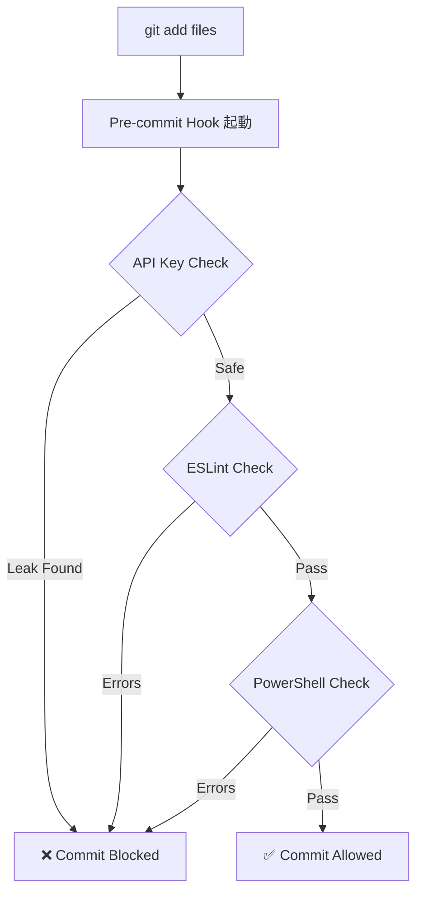

# Code Quality Workflow

Windows環境でのコード品質管理ワークフロー。ESLint、Pre-commit Hooks、自動レビューシステムを統合。

---

## 📋 概要

### 目的
- コード品質の自動チェック
- コミット前のバリデーション
- 継続的な品質改善

### 対象プロジェクト
- windows-code-mode (Capacitor + Web)
- windows-ai-assistant-knowledge-hub (Documentation)
- PowerShellスクリプト

---

## 🔧 ツールセット

### 1. ESLint (JavaScript/TypeScript)
**用途**: リアルタイムコードチェック

**インストール**:
```powershell
npm install --save-dev eslint eslint_d vscode-langservers-extracted
```

**設定ファイル**: `eslint.config.js`
```javascript
export default [
    {
        languageOptions: {
            ecmaVersion: 2022,
            sourceType: "module",
            globals: {
                window: "readonly",
                document: "readonly"
            }
        },
        rules: {
            "no-unused-vars": ["warn", { "args": "none" }],
            "no-undef": "error"
        }
    }
];
```

**実行**:
```powershell
# チェック
npx eslint script.js

# 自動修正
npx eslint script.js --fix

# 監視モード
npx eslint script.js --watch
```

---

### 2. Pre-commit Hooks
**用途**: コミット前の自動検証

**場所**: `.git/hooks/pre-commit`

**チェック内容**:
- ✅ APIキー漏洩スキャン
- ✅ ESLint構文チェック
- ✅ PowerShell構文検証
- ✅ ファイルサイズ制限

**詳細**: [pre-commit-hooks.md](./pre-commit-hooks.md)

---

### 3. PSScriptAnalyzer (PowerShell)
**用途**: PowerShellコード品質チェック

**インストール**:
```powershell
Install-Module -Name PSScriptAnalyzer -Scope CurrentUser
```

**実行**:
```powershell
# スクリプト分析
Invoke-ScriptAnalyzer -Path .\script.ps1

# 重大度指定
Invoke-ScriptAnalyzer -Path .\script.ps1 -Severity Error,Warning

# 再帰的スキャン
Invoke-ScriptAnalyzer -Path .\scripts\ -Recurse
```

---

## 📊 ワークフロー

### コミット前チェック



### 継続的品質改善

1. **日次チェック**
   ```powershell
   # 全ファイルスキャン
   npx eslint src/**/*.js
   Invoke-ScriptAnalyzer -Path .\scripts\ -Recurse
   ```

2. **週次レビュー**
   - エラーパターン分析
   - ルール調整
   - ベストプラクティス更新

3. **月次監査**
   - 品質メトリクス集計
   - トレンド分析
   - チーム共有

---

## 🎯 品質基準

### JavaScript/TypeScript

| カテゴリ | ルール | レベル |
|---------|--------|--------|
| 未使用変数 | no-unused-vars | Warning |
| 未定義変数 | no-undef | Error |
| セミコロン | semi | Warning |
| 引用符 | quotes (single) | Warning |

### PowerShell

| カテゴリ | ルール | レベル |
|---------|--------|--------|
| 承認動詞 | PSUseApprovedVerbs | Warning |
| 出力型宣言 | PSProvideCommentHelp | Information |
| エラー処理 | PSUseShouldProcessForStateChangingFunctions | Warning |

---

## 🔗 関連ドキュメント

- [ESLint Integration Guide](./eslint-integration.md)
- [Pre-commit Hooks Setup](./pre-commit-hooks.md)
- [API Key Security](../api-key-security/local-only-management.md)

---

## 💡 ベストプラクティス

### DO ✅
- コミット前にローカルでESLint実行
- Pre-commit hookを有効化
- 警告レベルも定期的に修正
- 自動修正機能を活用

### DON'T ❌
- `--no-verify`でhookをバイパス（緊急時以外）
- エラーを無視してコミット
- ルールを無効化せず理解する
- 品質チェックを後回しにしない

---

**Last Updated**: 2025-10-02
**Maintained By**: Windows AI Assistant Knowledge Hub
