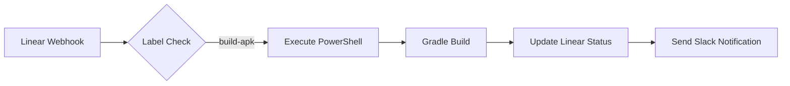
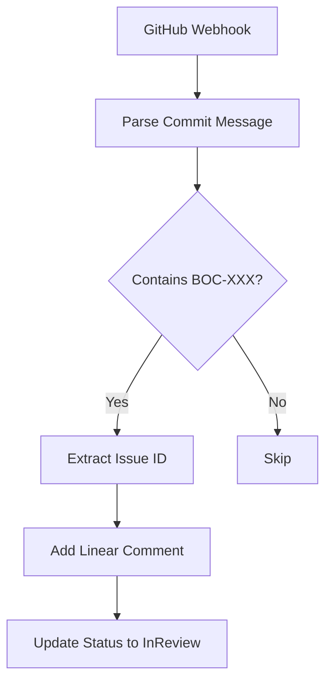
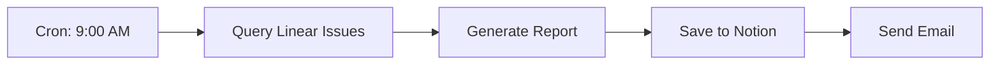

# n8n MCP Workflow Automation Guide

n8n MCP統合ガイド。536ワークフローノードを活用した自動化システム構築。

---

## 🎯 概要

### n8n MCPとは

**ノーコード/ローコードワークフロー自動化ツールのMCP実装**
- 536種類のノード（Webhook、HTTP、Database等）
- ビジュアルワークフローエディタ
- Linear/GitHub/Notion/Slack統合
- Cron/Webhook/Manual trigger

### ユースケース

1. **Linear Issue → APKビルド自動化**
2. **GitHub Push → Linear更新**
3. **ビルド完了 → Slack通知**
4. **定期レポート生成 → Notion保存**

---

## 📦 インストール

### 1. n8n本体インストール

```powershell
# NPMでインストール
npm install -g n8n

# または Docker（推奨）
docker run -it --rm --name n8n -p 5678:5678 n8nio/n8n
```

### 2. n8n起動

```powershell
# ローカル起動
n8n start

# バックグラウンド起動
n8n start --tunnel

# 特定ポート
n8n start --port 5678
```

アクセス: http://localhost:5678

### 3. Claude Desktop設定

**ファイル**: `$env:APPDATA\Claude\claude_desktop_config.json`

```json
{
  "mcpServers": {
    "n8n-mcp": {
      "command": "npx",
      "args": [
        "@n8n-mcp/server"
      ],
      "env": {
        "N8N_API_KEY": "YOUR_N8N_API_KEY",
        "N8N_BASE_URL": "http://localhost:5678"
      }
    }
  }
}
```

### 4. APIキー設定

```powershell
# n8n API keyを生成
# n8n UI → Settings → API → Create API Key

# 環境変数に保存
Set-Content "$env:USERPROFILE\.n8n-api-key" -Value "YOUR_API_KEY"
```

---

## 🔧 基本的なワークフロー

### ワークフロー1: Linear Issue → APKビルド

**トリガー**: Linear Issueにラベル "build-apk" 追加



**n8n設定**:

1. **Webhook Node** (Trigger)
   - URL: `http://localhost:5678/webhook/linear-build`
   - Method: POST
   - Authentication: None

2. **IF Node** (Condition)
   ```javascript
   // Check if label is "build-apk"
   {{ $json.data.label.name === "build-apk" }}
   ```

3. **Execute Command Node**
   ```powershell
   pwsh -File C:\path\to\scripts\build-apk.ps1 -IssueId {{ $json.data.issue.id }}
   ```

4. **HTTP Request Node** (Linear API)
   ```json
   {
     "url": "https://api.linear.app/graphql",
     "method": "POST",
     "headers": {
       "Authorization": "{{ $env.LINEAR_API_KEY }}"
     },
     "body": {
       "query": "mutation { issueUpdate(...) }"
     }
   }
   ```

5. **Slack Node** (Notification)
   ```
   Channel: #builds
   Message: ✅ APK Build Complete for {{ $json.issue.identifier }}
   ```

---

### ワークフロー2: GitHub Push → Linear自動更新

**トリガー**: GitHub Pushイベント



**n8n設定**:

1. **Webhook Node**
   - URL: `http://localhost:5678/webhook/github-push`

2. **Code Node** (JavaScript)
   ```javascript
   // Extract issue ID from commit message
   const message = $input.item.json.commits[0].message;
   const match = message.match(/BOC-\d+/);

   return {
     issueId: match ? match[0] : null,
     commitMessage: message
   };
   ```

3. **IF Node**
   ```javascript
   {{ $json.issueId !== null }}
   ```

4. **HTTP Request** (Linear Comment)
   ```graphql
   mutation {
     commentCreate(
       input: {
         issueId: "{{ $json.issueId }}",
         body: "🔄 Commit pushed: {{ $json.commitMessage }}"
       }
     )
   }
   ```

---

### ワークフロー3: 定期レポート生成

**トリガー**: 毎日9:00 AM



**n8n設定**:

1. **Cron Node**
   ```
   Expression: 0 9 * * *
   Timezone: Asia/Tokyo
   ```

2. **HTTP Request** (Linear API)
   ```graphql
   query {
     issues(filter: { state: { name: { in: ["In Progress", "Done"] } } }) {
       nodes {
         identifier
         title
         state { name }
         updatedAt
       }
     }
   }
   ```

3. **Code Node** (Report Generation)
   ```javascript
   const issues = $input.item.json.data.issues.nodes;

   const report = {
     date: new Date().toISOString().split('T')[0],
     total: issues.length,
     byStatus: {
       inProgress: issues.filter(i => i.state.name === 'In Progress').length,
       done: issues.filter(i => i.state.name === 'Done').length
     }
   };

   return { report };
   ```

4. **Notion Node**
   ```json
   {
     "databaseId": "YOUR_DATABASE_ID",
     "properties": {
       "Date": { "date": { "start": "{{ $json.report.date }}" } },
       "Total Issues": { "number": {{ $json.report.total }} }
     }
   }
   ```

---

## 🔌 主要ノード解説

### 1. Webhook Node (Trigger)

**用途**: 外部サービスからのHTTPリクエスト受信

```javascript
// Linear Webhookの例
{
  "event": "issue.update",
  "data": {
    "issue": {
      "id": "abc123",
      "identifier": "BOC-123",
      "title": "Implement feature X"
    }
  }
}
```

### 2. HTTP Request Node

**用途**: APIコール（Linear, GitHub, Slack等）

```json
{
  "method": "POST",
  "url": "https://api.linear.app/graphql",
  "headers": {
    "Authorization": "{{ $env.LINEAR_API_KEY }}",
    "Content-Type": "application/json"
  },
  "body": {
    "query": "mutation { ... }"
  }
}
```

### 3. Code Node (JavaScript/Python)

**用途**: カスタムロジック実装

```javascript
// Issue IDをパース
const issueId = $input.item.json.issue.identifier;
const [project, number] = issueId.split('-');

return {
  project,
  issueNumber: parseInt(number)
};
```

### 4. Execute Command Node

**用途**: PowerShellスクリプト実行

```powershell
# PowerShellコマンド
pwsh -File "C:\scripts\build-apk.ps1" -IssueId "{{ $json.issueId }}"
```

### 5. IF Node (Condition)

**用途**: 条件分岐

```javascript
// ラベルチェック
{{ $json.label.name === "urgent" }}

// 複数条件
{{ $json.priority === "high" && $json.assignee !== null }}
```

---

## 📊 実際の統合例

### Linear + n8n + PowerShell統合

**シナリオ**: Linearでラベル追加 → 自動ビルド → 結果通知

**ステップ1: Linear Webhook設定**

Linear UI:
```
Settings → API → Webhooks → Create Webhook
URL: http://localhost:5678/webhook/linear-build
Events: Issue updated
```

**ステップ2: n8nワークフロー作成**

```javascript
// Webhook受信
Webhook Node →
  // ラベルチェック
  IF Node (label === "build-apk") →
    // PowerShell実行
    Execute Command →
      // Linear更新
      HTTP Request (Linear API) →
        // Slack通知
        Slack Node
```

**ステップ3: PowerShellスクリプト**

`scripts/build-apk.ps1`:
```powershell
param([string]$IssueId)

# ビルド実行
.\gradlew assembleDebug

# 結果をn8nに返す
if ($LASTEXITCODE -eq 0) {
    Write-Output "SUCCESS"
} else {
    Write-Output "FAILED"
    exit 1
}
```

---

## 🛠️ トラブルシューティング

### 問題1: Webhook が受信されない

**原因**: ファイアウォール/ポートブロック

**解決策**:
```powershell
# ファイアウォール確認
netstat -an | Select-String "5678"

# ngrok経由で公開（開発時）
ngrok http 5678
# → https://xxxx.ngrok.io を Linear Webhook URLに設定
```

### 問題2: API Key が認識されない

**原因**: 環境変数の設定ミス

**解決策**:
```powershell
# Claude Desktop設定確認
cat "$env:APPDATA\Claude\claude_desktop_config.json"

# 環境変数確認
Get-Content "$env:USERPROFILE\.n8n-api-key"
```

### 問題3: ワークフロー実行が遅い

**原因**: 同期実行の積み重ね

**解決策**:
```javascript
// 並列実行ノード使用
Split In Batches Node → Process in parallel
```

---

## 💡 ベストプラクティス

### DO ✅

1. **エラーハンドリング必須**
   ```javascript
   // Error Trigger Node追加
   On Error → Send Alert → Rollback
   ```

2. **環境変数で秘密情報管理**
   ```json
   {
     "env": {
       "LINEAR_API_KEY": "{{ $env.LINEAR_API_KEY }}"
     }
   }
   ```

3. **ログ記録**
   ```javascript
   // Code Node
   console.log(`[${new Date().toISOString()}] Workflow executed: ${$workflow.name}`);
   ```

4. **ワークフロー命名規則**
   ```
   [Service]-[Trigger]-[Action]
   例: Linear-LabelAdded-BuildAPK
   ```

### DON'T ❌

1. ❌ APIキーをワークフロー内にハードコード
2. ❌ エラー処理を省略
3. ❌ 無限ループリスク（Webhook → API → Webhook）
4. ❌ 複雑すぎるワークフロー（分割推奨）

---

## 🔗 他MCPとの連携

### Sequential Thinking + n8n

```javascript
// Sequential Thinkingで戦略立案
await sequentialthinking({
  thought: "n8n workflowで3段階自動化: Webhook受信 → ビルド → 通知"
});

// n8n MCP経由で実行
await n8nExecuteWorkflow({
  workflowId: "linear-build-automation"
});
```

### Linear API + n8n

```javascript
// Linear更新をn8nでトリガー
Webhook (Linear) → n8n → PowerShell → Linear API
```

---

## 📚 参考リソース

### n8n公式

- [n8n Documentation](https://docs.n8n.io/)
- [Node Reference](https://docs.n8n.io/integrations/)
- [Workflow Examples](https://n8n.io/workflows/)

### 統合ガイド

- [Linear Integration](https://docs.n8n.io/integrations/builtin/app-nodes/n8n-nodes-base.linear/)
- [GitHub Integration](https://docs.n8n.io/integrations/builtin/app-nodes/n8n-nodes-base.github/)
- [Slack Integration](https://docs.n8n.io/integrations/builtin/app-nodes/n8n-nodes-base.slack/)

---

## 🎯 まとめ

n8n MCPは:

1. **ノーコード自動化** - 複雑なワークフローをGUIで構築
2. **536ノード** - あらゆるサービス統合
3. **イベント駆動** - Webhook/Cron/Manual trigger
4. **PowerShell連携** - Windows環境と完璧統合

**推奨**: Linear自動化に必須！

---

**Last Updated**: 2025-10-02
**MCP Server**: @n8n-mcp/server v1.0
**Maintained By**: Windows AI Assistant Knowledge Hub
