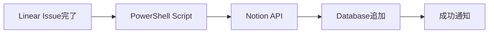

# Notion API MCP Integration Guide

Notion API MCP統合ガイド。日本語対応ドキュメント管理システム構築。

---

## 🎯 概要

### Notion API MCPとは

**日本語完全対応のドキュメント管理MCP実装**
- Database/Page CRUD操作
- 日本語タイトル・本文完全サポート
- Linear連携（Issue → Notion自動保存）
- リッチテキスト・画像・コードブロック対応

### ユースケース

1. **Linear Issue → Notion Database保存**
2. **開発ログ自動記録**
3. **エラー解決ナレッジベース**
4. **プロジェクト進捗レポート**

---

## 📦 セットアップ

### 1. Notion Integration作成

**Notion UI**:
```
Settings & Members → Integrations → Develop your own integrations
→ New integration

Name: windows-ai-assistant
Capabilities: Read content, Update content, Insert content
```

**Integration Token取得**:
```
secret_XXXXXXXXXXXXXXXXXXXXXXXXXXXXXXXXXXXXXXXX
```

### 2. APIキー保存

```powershell
# セキュアに保存
Set-Content "$env:USERPROFILE\.notion-api-key" -Value "secret_YOUR_TOKEN_HERE"
```

### 3. Database共有設定

**Notion Database**:
```
Database右上 → Share → Invite → windows-ai-assistant
```

### 4. Claude Desktop設定

**ファイル**: `$env:APPDATA\Claude\claude_desktop_config.json`

```json
{
  "mcpServers": {
    "notion": {
      "command": "npx",
      "args": [
        "@notionhq/client"
      ],
      "env": {
        "NOTION_API_KEY": "YOUR_NOTION_API_KEY"
      }
    }
  }
}
```

---

## 🔧 基本操作

### Database ID取得

**方法1: URLから取得**
```
https://www.notion.so/workspace/DATABASE_ID?v=...
                          ^^^^^^^^^^^^
```

**方法2: API経由**
```javascript
const { Client } = require('@notionhq/client');

const notion = new Client({
  auth: process.env.NOTION_API_KEY
});

// 全Database取得
const response = await notion.search({
  filter: { property: 'object', value: 'database' }
});

console.log(response.results[0].id);
```

### Page作成（日本語対応）

```javascript
const response = await notion.pages.create({
  parent: {
    database_id: 'YOUR_DATABASE_ID'
  },
  properties: {
    // タイトル（日本語）
    'Name': {
      title: [
        {
          text: {
            content: '新機能実装: APK自動ビルド'
          }
        }
      ]
    },
    // ステータス
    'Status': {
      select: {
        name: '進行中'
      }
    },
    // 日付
    'Date': {
      date: {
        start: '2025-10-02'
      }
    }
  },
  children: [
    // 本文（日本語）
    {
      object: 'block',
      type: 'paragraph',
      paragraph: {
        rich_text: [
          {
            type: 'text',
            text: {
              content: 'Linear Issue BOC-123の実装を開始しました。'
            }
          }
        ]
      }
    }
  ]
});
```

### Database検索（日本語クエリ）

```javascript
const response = await notion.databases.query({
  database_id: 'YOUR_DATABASE_ID',
  filter: {
    property: 'Status',
    select: {
      equals: '完了'  // 日本語ステータス
    }
  },
  sorts: [
    {
      property: 'Date',
      direction: 'descending'
    }
  ]
});
```

---

## 📊 Linear → Notion連携

### ワークフロー: Issue完了時に自動保存



### PowerShellスクリプト例

**scripts/sync-linear-to-notion.ps1**:
```powershell
param(
    [string]$IssueId,
    [string]$IssueTitle,
    [string]$Status
)

# Notion APIキー読み込み
$notionKey = (Get-Content "$env:USERPROFILE\.notion-api-key" -Raw).Trim()
$databaseId = "YOUR_DATABASE_ID"

# ページ作成
$body = @{
    parent = @{
        database_id = $databaseId
    }
    properties = @{
        'Issue ID' = @{
            title = @(
                @{
                    text = @{
                        content = $IssueId
                    }
                }
            )
        }
        'Title' = @{
            rich_text = @(
                @{
                    text = @{
                        content = $IssueTitle
                    }
                }
            )
        }
        'Status' = @{
            select = @{
                name = $Status
            }
        }
        'Date' = @{
            date = @{
                start = (Get-Date -Format "yyyy-MM-dd")
            }
        }
    }
} | ConvertTo-Json -Depth 10

# Notion API実行
$response = Invoke-RestMethod `
    -Uri "https://api.notion.com/v1/pages" `
    -Method Post `
    -Headers @{
        "Authorization" = "Bearer $notionKey"
        "Notion-Version" = "2022-06-28"
        "Content-Type" = "application/json"
    } `
    -Body $body

Write-Host "✅ Notionに保存完了: $($response.id)"
```

### Linear Hookと統合

```powershell
# Linear Issue完了時に実行
.\scripts\sync-linear-to-notion.ps1 `
    -IssueId "BOC-123" `
    -IssueTitle "APK自動ビルド機能" `
    -Status "完了"
```

---

## 🎨 リッチコンテンツ作成

### コードブロック追加

```javascript
{
  type: 'code',
  code: {
    rich_text: [
      {
        type: 'text',
        text: {
          content: 'npm install -g n8n'
        }
      }
    ],
    language: 'powershell'
  }
}
```

### 箇条書きリスト（日本語）

```javascript
{
  type: 'bulleted_list_item',
  bulleted_list_item: {
    rich_text: [
      {
        type: 'text',
        text: {
          content: 'タスク1: 環境構築'
        }
      }
    ]
  }
}
```

### 画像埋め込み

```javascript
{
  type: 'image',
  image: {
    type: 'external',
    external: {
      url: 'https://example.com/screenshot.png'
    }
  }
}
```

---

## 📋 Database構造例

### 開発ログDatabase

| プロパティ | 型 | 説明 |
|-----------|-----|------|
| Issue ID | Title | BOC-123形式 |
| タイトル | Text | Issue概要 |
| ステータス | Select | 進行中/完了/保留 |
| 優先度 | Select | 高/中/低 |
| 作業日 | Date | YYYY-MM-DD |
| 工数 | Number | 時間 |
| タグ | Multi-select | bug, feature, refactor |
| メモ | Text | 詳細説明 |

### エラーナレッジベースDatabase

| プロパティ | 型 | 説明 |
|-----------|-----|------|
| エラー名 | Title | 'window is not defined' |
| カテゴリ | Select | ESLint, Build, API |
| 原因 | Text | 根本原因の説明 |
| 解決策 | Text | 修正方法 |
| コード例 | Text | コードスニペット |
| 発生日 | Date | 初回発生日 |
| 再発防止 | Checkbox | ✅/☐ |

---

## 🛠️ 実用スクリプト集

### 1. エラーログ自動記録

**scripts/log-error-to-notion.ps1**:
```powershell
param(
    [string]$ErrorName,
    [string]$ErrorMessage,
    [string]$Solution
)

$notionKey = (Get-Content "$env:USERPROFILE\.notion-api-key" -Raw).Trim()
$databaseId = "ERROR_DB_ID"

$body = @{
    parent = @{ database_id = $databaseId }
    properties = @{
        'エラー名' = @{
            title = @(@{ text = @{ content = $ErrorName } })
        }
        'エラー内容' = @{
            rich_text = @(@{ text = @{ content = $ErrorMessage } })
        }
        '解決策' = @{
            rich_text = @(@{ text = @{ content = $Solution } })
        }
        '発生日' = @{
            date = @{ start = (Get-Date -Format "yyyy-MM-dd") }
        }
    }
} | ConvertTo-Json -Depth 10

Invoke-RestMethod `
    -Uri "https://api.notion.com/v1/pages" `
    -Method Post `
    -Headers @{
        "Authorization" = "Bearer $notionKey"
        "Notion-Version" = "2022-06-28"
        "Content-Type" = "application/json"
    } `
    -Body $body

Write-Host "✅ エラーログ記録完了"
```

### 2. 週次レポート生成

**scripts/generate-weekly-report.ps1**:
```powershell
# Linear APIから今週のIssue取得
$linearKey = (Get-Content "$env:USERPROFILE\.linear-api-key" -Raw).Trim()

# (Linear API呼び出し省略)

# Notion Pageとして保存
$notionKey = (Get-Content "$env:USERPROFILE\.notion-api-key" -Raw).Trim()

$body = @{
    parent = @{ database_id = "REPORT_DB_ID" }
    properties = @{
        'レポート名' = @{
            title = @(@{ text = @{ content = "週次レポート $(Get-Date -Format 'yyyy-MM-dd')" } })
        }
        '完了Issue数' = @{
            number = 15
        }
        '進行中Issue数' = @{
            number = 8
        }
    }
} | ConvertTo-Json -Depth 10

# (Notion API実行)
```

---

## 🔍 トラブルシューティング

### 問題1: "object not found" エラー

**原因**: DatabaseがIntegrationに共有されていない

**解決策**:
```
Notion Database → Share → Invite → windows-ai-assistant
```

### 問題2: 日本語が文字化け

**原因**: UTF-8エンコーディング問題

**解決策**:
```powershell
# PowerShellで明示的にUTF-8指定
[Console]::OutputEncoding = [System.Text.Encoding]::UTF8
$body = ConvertTo-Json -Depth 10 -Compress
```

### 問題3: API Rate Limit超過

**原因**: 短時間に大量リクエスト

**解決策**:
```powershell
# リトライロジック追加
$retryCount = 0
while ($retryCount -lt 3) {
    try {
        $response = Invoke-RestMethod ...
        break
    } catch {
        if ($_.Exception.Response.StatusCode -eq 429) {
            Start-Sleep -Seconds ([Math]::Pow(2, $retryCount))
            $retryCount++
        }
    }
}
```

---

## 💡 ベストプラクティス

### DO ✅

1. **Database構造を事前設計**
   - プロパティ型を明確化
   - Select optionsを定義

2. **日本語プロパティ名OK**
   ```javascript
   properties: {
     'ステータス': { select: { name: '完了' } }
   }
   ```

3. **APIバージョン指定**
   ```javascript
   headers: {
     'Notion-Version': '2022-06-28'
   }
   ```

4. **エラーハンドリング必須**
   ```powershell
   try { ... } catch { Write-Error $_ }
   ```

### DON'T ❌

1. ❌ APIキーをコードにハードコード
2. ❌ Database IDをコミット（.gitignore追加）
3. ❌ 大量データを一括作成（バッチ処理推奨）
4. ❌ リトライなしのAPI呼び出し

---

## 🔗 他サービス連携

### Linear + Notion

```powershell
# Linear Issue完了 → Notion保存
.\scripts\sync-linear-to-notion.ps1 -IssueId "BOC-123"
```

### n8n + Notion

```javascript
// n8n Notion Node
Notion Node → Create Page → {
  database_id: "YOUR_DB_ID",
  properties: { ... }
}
```

### GitHub + Notion

```powershell
# GitHub Push → Notion更新
# Commit messageからIssue ID抽出 → Notion検索 → 更新
```

---

## 📚 参考リソース

### 公式ドキュメント

- [Notion API Reference](https://developers.notion.com/reference/intro)
- [Database Query Filter](https://developers.notion.com/reference/post-database-query-filter)
- [Rich Text Objects](https://developers.notion.com/reference/rich-text)

### サンプルコード

- [Notion SDK for JavaScript](https://github.com/makenotion/notion-sdk-js)
- [PowerShell Notion Examples](https://gist.github.com/)

---

## 🎯 まとめ

Notion API MCPは:

1. **日本語完全対応** - タイトル・本文すべて日本語OK
2. **Linear連携** - Issue自動保存・ナレッジ蓄積
3. **リッチコンテンツ** - コード・画像・リスト対応
4. **Windows統合** - PowerShellで完璧連携

**推奨**: 開発ログ・エラーナレッジベースに必須！

---

**Last Updated**: 2025-10-02
**API Version**: 2022-06-28
**Maintained By**: Windows AI Assistant Knowledge Hub
